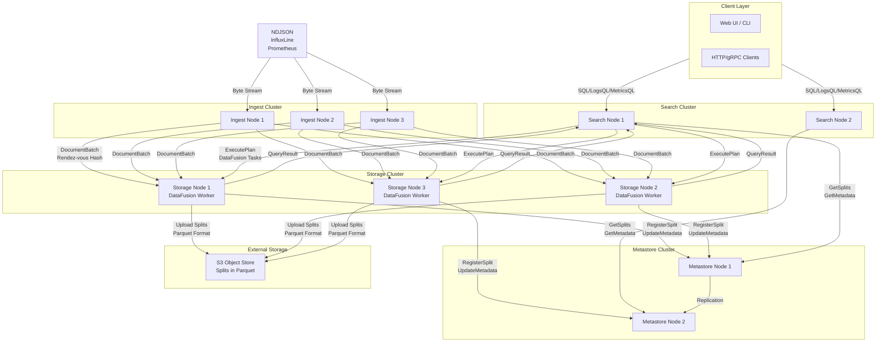
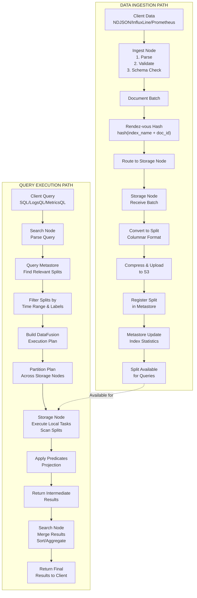
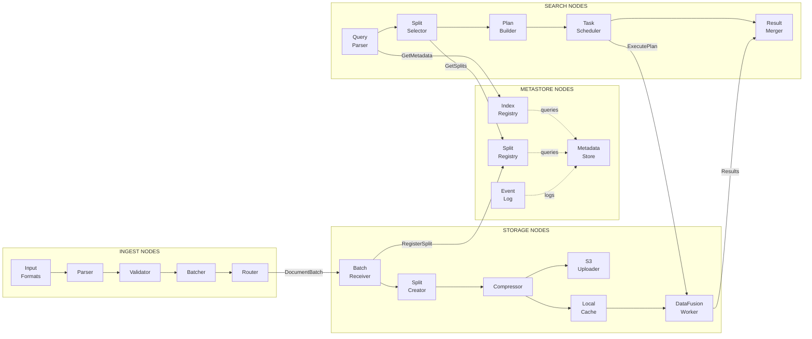
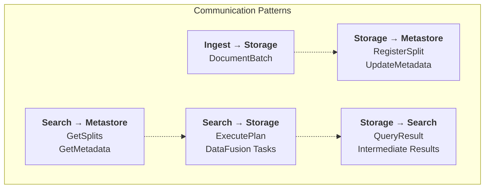
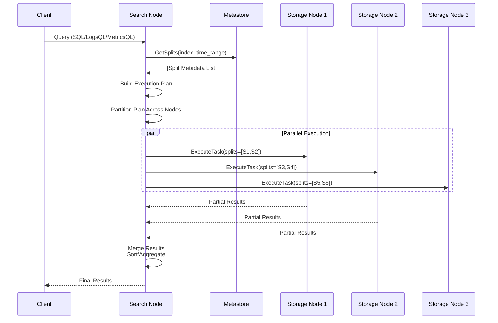
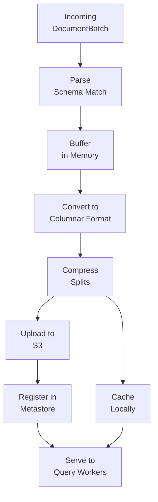
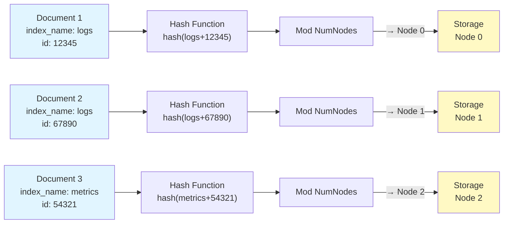

# QuartzDB Architecture Diagrams

## 1. System Architecture Overview

## 2. Data Flow: Ingestion and Query Paths

## 3. Component Responsibilities and Interactions

## 4. Request/Response Communication Matrix

## 5. Distributed Query Execution Timeline

## 6. Storage Node Data Processing Pipeline

## 7. Rendez-vous Hashing Distribution

## Key Architectural Principles

1. **Horizontal Scalability**: Each component type can scale independently
2. **Data Locality**: Documents routed to same node via deterministic hashing
3. **Fault Tolerance**: Metastore replication, S3 durability, split redundancy
4. **Separation of Concerns**: Each node type has specific, well-defined responsibilities
5. **Eventual Consistency**: Async updates between components coordinated via Metastore
6. **Query Distribution**: DataFusion enables flexible, distributed query execution
